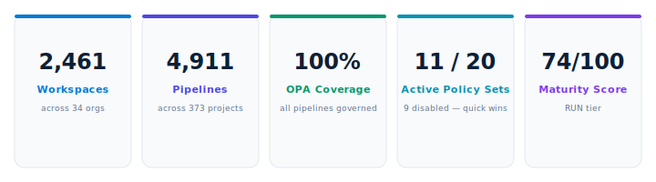
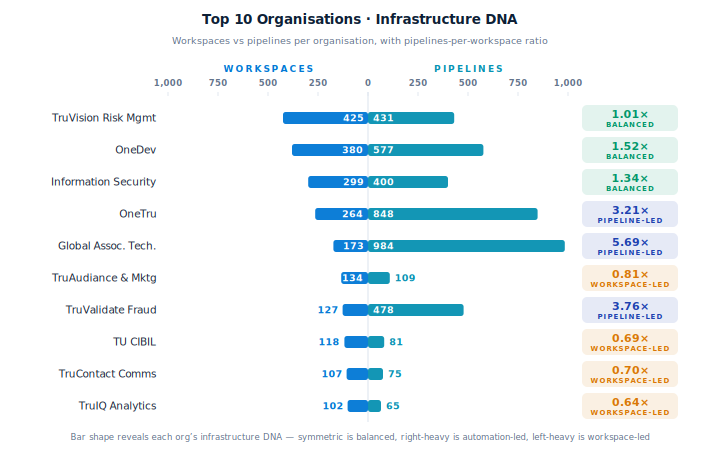
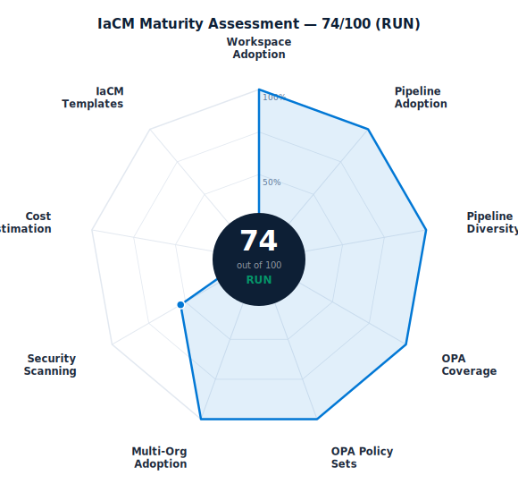
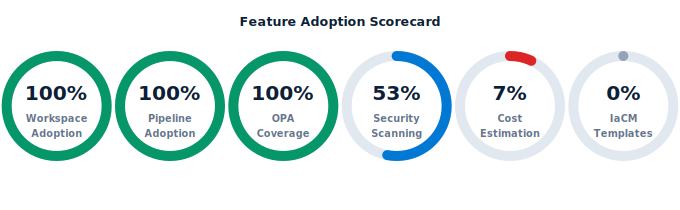
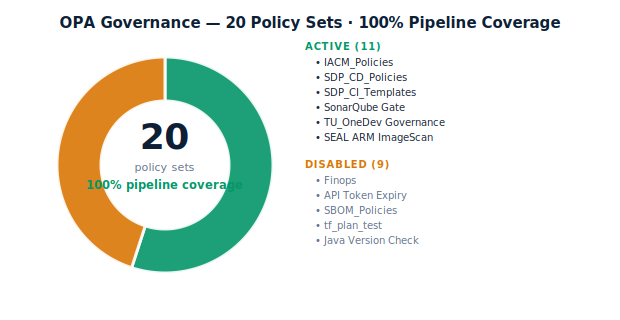
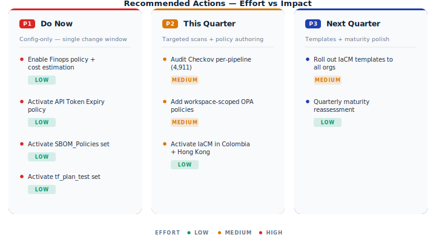

# Executive Summary

TransUnion operates one of the largest Harness IaCM deployments in production today — **2,461 workspaces** and **4,911 pipelines** spread across **34 organisational units in 8 active geographies**, with **100% OPA enforcement on every pipeline execution**.

The platform is no longer a pilot. It is the default control plane for Terraform and OpenTofu provisioning across credit risk, fraud prevention, marketing analytics, security operations, and global infrastructure. The maturity score sits firmly in the **RUN tier (74 / 100)**, with a clear, configuration-only path to **90+** within a single quarter.

::: success
**The headline.** Six of nine maturity dimensions score full marks. Three remaining gaps — cost estimation, IaCM templates, and per-pipeline Checkov audit — are toggles or one-off scans, not engineering projects.
:::

---

# 1. Enterprise Footprint

TransUnion's IaCM programme is genuinely enterprise-wide. Every major business unit — risk, fraud, marketing, security, communications, analytics, and platform — has live workspaces and pipelines. There is no single team carrying the deployment; it is the platform.

::: success
**Breadth, not just scale.** OneTru runs **848 pipelines** across 30 workspaces. TruVision Risk Management owns **425 workspaces** spanning credit risk, driver history, factor trust, and data acquisition. Global Associate Technology Solutions runs **984 pipelines** — the highest single-org pipeline count in the account.
:::

### Geographic Coverage

The estate is deployed across 8 active regions and 2 configured-but-dormant regions. Colombia and Hong Kong are licensed and project-scaffolded but carry zero workspaces — both are zero-effort expansions using proven CIBIL and US patterns.

| Region | Workspaces | Status |
|--------|-----------|--------|
| United States | 1,800+ | Active |
| India — CIBIL | 118 | Active |
| Africa | 33 | Active |
| Brazil | 30 | Active |
| Dominican Republic | 30 | Active |
| Chile | 30 | Active |
| Central America | 30 | Active |
| United Kingdom | 15 | Active |
| Colombia | 0 | Configured — not yet active |
| Hong Kong | 0 | Configured — not yet active |

::: info
Activating Colombia and Hong Kong would extend unified governance to two strategic geographies with zero engineering effort — the projects, connectors, and policies already exist.
:::

---

# 2. Maturity Assessment — RUN Tier

TransUnion scores **74 out of 100**, firmly inside the **RUN tier** of the IaCM maturity model. Six of nine dimensions reach maximum score. The two material gaps are cost estimation (FinOps policy disabled across the estate) and IaCM templates (not yet adopted).

::: info
**Path to 90+.** Enable cost estimation on all production workspaces (**+14 pts**) and complete a per-pipeline Checkov audit (**+7 pts**). Both are achievable within a single quarter without any code changes.
:::

| Dimension | Score | Max | Status |
|-----------|-------|-----|--------|
| Workspace Adoption | 20 | 20 | Full marks |
| Pipeline Adoption | 15 | 15 | Full marks |
| Pipeline Diversity | 10 | 10 | Full marks |
| OPA Pipeline Coverage | 10 | 10 | Full marks |
| OPA Policy Sets | 5 | 5 | Full marks |
| Multi-Org Adoption | 5 | 5 | Full marks |
| Security Scanning | 8 | 15 | Partial — SEAL active, Checkov audit pending |
| Cost Estimation | 1 | 15 | Gap — FinOps policy disabled |
| IaCM Templates | 0 | 5 | Gap — not yet assessed |
| **Total** | **74** | **100** | **RUN** |

---

# 3. Feature Adoption

Workspace adoption, pipeline adoption, and OPA pipeline coverage all sit at **100%** — exceptional for a platform of this scale. The two open gaps are pre-apply cost visibility and standardised IaCM templates.

::: critical
**Cost estimation is disabled on all 2,461 workspaces.** At TransUnion's run-rate — thousands of plan and apply cycles every day across 34 orgs — this is the largest remaining governance gap. The FinOps policy set is already authored in the account; activation is a single toggle.
:::

::: warning
**Per-pipeline Checkov coverage is estimated at ~53%.** The TU_Security_SEAL framework enforces image scanning, SBOM, and version compliance at the policy layer, but per-pipeline IaCM Checkov has not been audited at scale across all 4,911 pipelines. A targeted scan would confirm and close any production gaps.
:::

---

# 4. OPA Governance

**100% of 4,911 pipelines** are governed by account-level OPA policy sets. TransUnion has built a 7-layer security framework — the **TU_Security_SEAL** family — that enforces ARM image scanning, vulnerability detection, SBOM generation, image publish control, and version compliance on every pipeline execution.

::: success
**SEAL is best-in-class.** Seven dedicated security policy sets provide defence-in-depth across the full software supply chain — a strong foundation for compliance, audit, and enterprise risk management at global scale.
:::

::: action
**Quick win: activate 4 disabled policy sets.** The Finops, SBOM_Policies, API Token Expiry, and tf_plan_test sets are authored, validated, and ready. Together they close cost governance, SBOM coverage, token security, and plan validation gaps in a single change window — no authoring, no testing, no engineering.
:::

---

# 5. Recommended Actions

The top-left quadrant — high impact, low effort — contains **three P1 actions, all configuration-only**. The single largest opportunity is enabling cost estimation; on its own it would deliver up to 14 maturity points and immediate FinOps visibility across the entire estate.

::: action
**P1 — Enable the Finops policy set + cost estimation.** Activate the authored Finops set. Turn on `cost_estimation_enabled` on the top 10 orgs' production workspaces. Connect to Harness CCM for cross-workspace dashboards. This is the single largest remaining maturity opportunity — a configuration change, not an engineering project.
:::

::: action
**P1 — Enable API Token Expiry, SBOM_Policies, and tf_plan_test.** All three are authored and validated. Token expiry closes a security compliance gap; SBOM_Policies extends existing SEAL SBOM coverage; tf_plan_test adds plan-time validation guardrails.
:::

::: action
**P2 — Audit and expand Checkov per-pipeline.** Run a full scan of all 4,911 pipelines to confirm exact coverage. Close gaps in production and destroy pipelines first. Target 100% to push the maturity score to **85+**.
:::

::: action
**P2 — Add workspace-scoped OPA policy sets.** Today's policy sets govern pipeline execution but not workspace configuration — provisioner version, required tags, repository validation. Workspace-level policies close the remaining configuration governance gap.
:::

::: action
**P2 — Activate IaCM in Colombia and Hong Kong.** Both regions are licensed and have projects configured. Reuse the proven CIBIL and US patterns. Near-zero engineering effort, immediate geographic expansion of unified governance.
:::

---

# 6. Before & After

| Without Full IaCM Adoption | TransUnion Today with Harness |
|---------------------------|-------------------------------|
| Infrastructure changes without audit trail | Every plan and apply governed by 11 active OPA policy sets |
| Per-team compliance — inconsistent | Unified enforcement across 34 orgs and 8 geographies |
| No pre-apply cost visibility | FinOps policy set authored — activation is one toggle |
| Security scanning ad hoc | 7-layer TU_Security_SEAL on every pipeline execution |
| Siloed team infrastructure automation | Single IaCM platform across all business units |
| Terraform drift undetected | Drift-detection pipelines present and active |
| No governance across geographies | 8 active regions under consistent policy control |

---

# Appendix — Organisation Summary

| Organisation | Workspaces | Pipelines |
|-------------|-----------|----------|
| TruVision_RiskManagement | 425 | 431 |
| OneDev | 380 | 577 |
| Information_Security | 299 | 400 |
| OneTru | 264 | 848 |
| Global_Associate_Technology_Solutions | 173 | 984 |
| TruAudiance_and_Marketing | 134 | 109 |
| TruValidate_FraudPrevention | 127 | 478 |
| TU_CIBIL | 118 | 81 |
| TruContact_Communications | 107 | 75 |
| TruIQ_AdvancedAnalytics | 102 | 65 |
| TruLookup_and_Investigations | 30 | 285 |
| TruEmpower_ConsumerEngagement | 32 | 30 |
| TU_Africa | 33 | 39 |
| Central_America | 30 | 1 |
| TU_Dominican_Republic | 30 | 34 |
| TU_BRAZIL | 30 | 8 |
| TU_CHILE | 30 | 3 |
| Harness_Platform_Management | 30 | 7 |
| TU_UK | 15 | 40 |
| TU_Enterprise | 14 | 7 |
| All remaining orgs | ~97 | ~429 |
| **Total** | **2,461** | **4,911** |

---

*Harness IaCM · Business Value Review · May 11, 2026 · TransUnion · Confidential*
