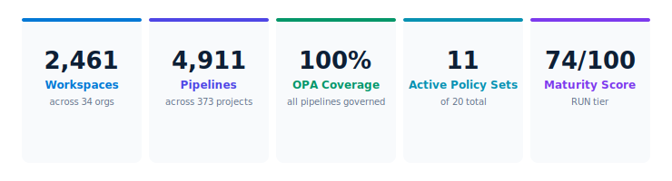
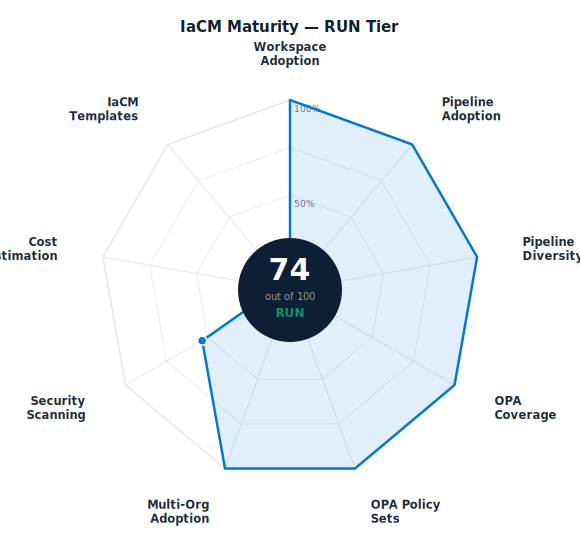
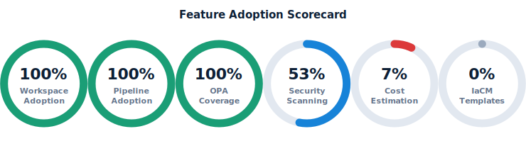
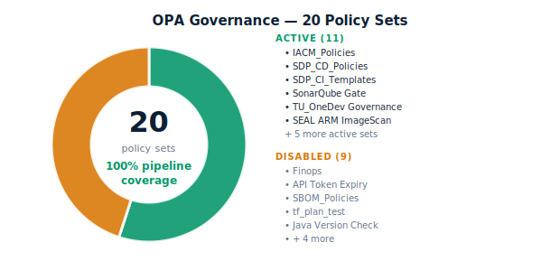

# IaCM — Business Value Review

TransUnion has built one of the most scaled Harness IaCM deployments globally — **2,461 workspaces** and **4,911 pipelines** across **34 organisational units** in 8 countries, with 100% OPA policy enforcement across every pipeline.

---

## 1. Enterprise Footprint

TransUnion's IaCM programme spans every major business unit — from credit risk and fraud prevention to marketing analytics, security operations, and global infrastructure.

::: success
The breadth of adoption is exceptional. IaCM is deployed across product, security, infrastructure, analytics, and communications — not siloed in a single team. OneTru alone has 848 pipelines across 30 workspaces, and TruVision_RiskManagement has 425 workspaces covering credit risk, driver history, factor trust, and data acquisition.
:::

### Geographic Coverage

TransUnion's IaCM programme is deployed in 8 active regions. Colombia and Hong Kong are configured but not yet active — near-term expansion opportunities using proven patterns.

| Region | Workspaces | Status |
|--------|-----------|--------|
| United States | 1,800+ | Active |
| India (CIBIL) | 118 | Active |
| Africa | 33 | Active |
| Brazil | 30 | Active |
| Dominican Republic | 30 | Active |
| Chile | 30 | Active |
| UK | 15 | Active |
| Central America | 30 | Active |
| Colombia | 0 | Configured |
| Hong Kong | 0 | Configured |

---

## 2. Maturity Assessment — RUN Tier

TransUnion scores **74 out of 100** — firmly in the **RUN tier**. Six of nine dimensions score full marks. The two gaps that prevent a 90+ score are Cost Estimation (disabled) and IaCM Templates (not assessed).

::: info
**Path to 90+ score:** Enable cost estimation on all workspaces (+14 pts) and audit Checkov per-pipeline coverage (+7 pts). Both are achievable within a single quarter.
:::

| Dimension | Score | Max | Status |
|-----------|-------|-----|--------|
| Workspace Adoption | 20 | 20 | Full marks |
| Pipeline Adoption | 15 | 15 | Full marks |
| Pipeline Diversity | 10 | 10 | Full marks |
| OPA Pipeline Coverage | 10 | 10 | Full marks |
| OPA Policy Sets | 5 | 5 | Full marks |
| Multi-Org Adoption | 5 | 5 | Full marks |
| Security Scanning | 8 | 15 | Partial — SEAL active |
| Cost Estimation | 1 | 15 | Gap — FinOps disabled |
| IaCM Templates | 0 | 5 | Gap — not assessed |

---

## 3. Feature Adoption

Workspace and pipeline adoption, OPA coverage, and OPA policy set count are all at **100%** — exceptional for a platform of this scale. The two open gaps are cost estimation and IaCM templates.

::: critical
**Cost estimation is disabled on all 2,461 workspaces.** At TransUnion's run-rate — thousands of Terraform plan/apply cycles daily — the absence of pre-apply cost visibility is the largest remaining governance gap. The FinOps policy set is authored and ready to activate.
:::

::: warning
**Security scanning adoption is estimated at ~53%.** The TU_Security_SEAL framework is active and enforced, but per-pipeline IaCMCheckov coverage has not been fully audited at this scale. A targeted scan of all 4,911 pipelines is recommended.
:::

---

## 4. OPA Governance

**100% of 4,911 pipelines** are covered by account-level policy sets. TransUnion has built a 7-layer security framework (TU_Security_SEAL family) that enforces ARM image scanning, vulnerability detection, SBOM generation, image publish control, and version compliance on every pipeline execution.

::: success
The SEAL security framework is best-in-class. Seven dedicated security policy sets enforce defence-in-depth across all pipelines — a strong foundation for compliance, audit, and supply chain security at global scale.
:::

::: action
**Quick win: Enable 4 low-risk disabled policy sets.** The Finops, SBOM_Policies, API Token Expiry, and tf_plan_test sets are authored, validated, and ready — activation is a single toggle per set. Together they close cost governance, SBOM, token security, and plan validation gaps in one afternoon.
:::

---

## 5. Recommended Actions

The top-left quadrant (high impact, low effort) contains three P1 actions — all are configuration toggles requiring no engineering work.

::: action
**P1 — Enable the Finops policy set + cost estimation.** Activate the authored Finops policy set and enable cost_estimation_enabled on all production workspaces. Connect to Harness CCM. This is the single largest remaining maturity gap — a configuration change, not an engineering project.
:::

::: action
**P1 — Enable API Token Expiry enforcement and SBOM_Policies.** Both are authored, validated, and low risk. API token expiry closes a security compliance gap. SBOM_Policies extends the existing SEAL SBOM coverage.
:::

::: action
**P2 — Add workspace-scoped OPA policies.** Create policy sets that govern workspace configuration — provisioner version, required tags, repository validation. Targets the configuration governance gap that pipeline-level policies cannot cover.
:::

::: action
**P2 — Audit and expand Checkov per-pipeline.** Run a full scan of all 4,911 pipelines to confirm exact Checkov coverage. Close gaps in production and destroy pipelines first. Target 100% to move maturity score to 85+.
:::

::: action
**P2 — Activate IaCM in Colombia and Hong Kong.** Both regions are licensed and configured. Use proven patterns from the US and CIBIL deployments. Near-zero engineering effort, immediate geographic governance expansion.
:::

---

## 6. Before and After

| Without Full IaCM Adoption | TransUnion Today with Harness |
|---------------------------|-------------------------------|
| Infrastructure changes without audit trail | Every plan and apply governed by OPA policies |
| Per-team compliance — inconsistent | 11 policy sets enforced account-wide automatically |
| No pre-apply cost visibility | Finops policy set ready to activate |
| Security scanning ad hoc | 7-layer TU_Security_SEAL on all pipelines |
| Siloed team infrastructure automation | 34 orgs, 10 geographies on one platform |
| Terraform drift undetected | Drift detection pipelines present |
| No governance across geographies | 8 active regions under consistent policy control |

---

## Appendix — Organisation Summary

| Org | Workspaces | Pipelines |
|-----|-----------|----------|
| TruVision_RiskManagement | 425 | 431 |
| OneDev | 380 | 577 |
| Information_Security | 299 | 400 |
| OneTru | 264 | 848 |
| Global_Associate_Technology_Solutions | 173 | 984 |
| TruAudiance and Marketing | 134 | 109 |
| TruValidate_FraudPrevention | 127 | 478 |
| TU_CIBIL | 118 | 81 |
| TruContact_Communications | 107 | 75 |
| TruIQ_AdvancedAnalytics | 102 | 65 |
| TruLookup and Investigations | 30 | 285 |
| Central_America | 30 | 1 |
| TU_Dominican_Republic | 30 | 34 |
| TU_BRAZIL | 30 | 8 |
| TU_CHILE | 30 | 3 |
| Harness_Platform_Management | 30 | 7 |
| TruEmpower_ConsumerEngagement | 32 | 30 |
| TU_Africa | 33 | 39 |
| TU_UK | 15 | 40 |
| TU_Enterprise | 14 | 7 |
| TU_CIBIL (remaining) | — | — |
| All others | ~77 | ~428 |
| **Total** | **2,461** | **4,911** |

---

*Harness IaCM · Business Value Review · May 9, 2026 · TransUnion · Confidential*
