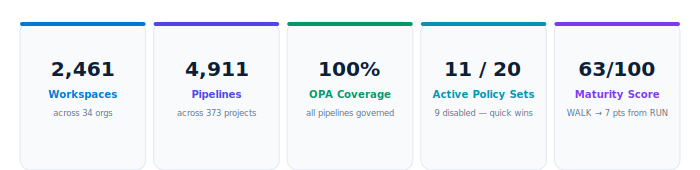
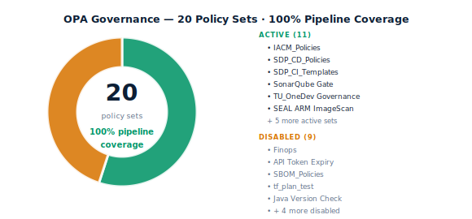

# IaCM — Business Value Review

TransUnion has built one of the most scaled Harness IaCM deployments globally — 2,461 workspaces and 4,911 pipelines across 34 organisational units in 8 countries, with 100% OPA policy enforcement on every pipeline execution.

---

## 1. Enterprise Footprint

TransUnion's IaCM programme spans every major business unit — credit risk, fraud prevention, marketing analytics, security operations, communications, and global infrastructure. The deployment is not siloed in a single team; it is a genuine enterprise-wide platform.

::: success
OneTru alone operates 848 pipelines across 30 workspaces. TruVision Risk Management has 425 workspaces covering credit, driver history, factor trust, and data acquisition. Global Associate Technology Solutions runs 984 pipelines — the highest pipeline count in the account.
:::

### Geographic Reach

| Region | Workspaces | Status |
|--------|-----------|--------|
| United States | 1,800+ | Active |
| India — CIBIL | 118 | Active |
| Africa | 33 | Active |
| Dominican Republic | 30 | Active |
| Brazil | 30 | Active |
| Chile | 30 | Active |
| Central America | 30 | Active |
| United Kingdom | 15 | Active |
| Colombia | 0 | Configured — not yet active |
| Hong Kong | 0 | Configured — not yet active |

::: info
Colombia (9 projects) and Hong Kong are licensed and configured with IaCM but have zero workspaces deployed. These represent zero-effort geographic expansion using proven patterns from CIBIL and US deployments.
:::

---

## 2. Maturity Assessment

TransUnion scores **63 out of 100** — in the **WALK tier**, 7 points from RUN. Six of nine dimensions achieve maximum score. The two meaningful gaps are cost estimation (FinOps policy disabled) and IaCM template adoption (not yet assessed at this scale).

| Dimension | Score | Max | Status |
|-----------|-------|-----|--------|
| Workspace Scale | 20 | 20 | Maximum |
| Pipeline Automation | 15 | 15 | Maximum |
| Policy Governance | 12 | 15 | Good — OPA 100%, 4 sets still disabled |
| Security & Compliance | 8 | 15 | Partial — SEAL active, Checkov gap |
| Cost Estimation | 1 | 15 | Gap — FinOps disabled |
| IaCM Templates | 0 | 10 | Not adopted |
| Private Module Registry | 0 | 5 | All public — no governance |
| Provisioner Strategy | 7 | 10 | Terraform + OpenTofu, modern approach |
| **Total** | **63** | **100** | **WALK** |

::: info
Path to 90+ score: Enable cost estimation across all workspaces (+14 pts) and audit Checkov per-pipeline coverage to confirm and close any gaps (+7 pts). Both are achievable within one quarter.
:::

---

## 3. Feature Adoption

Workspace adoption, pipeline adoption, and OPA pipeline coverage all reach **100%** — exceptional at this scale. The two open gaps are cost estimation and IaCM template standardisation.

::: critical
Cost estimation is disabled on all 2,461 workspaces. At TransUnion's run-rate — thousands of Terraform plan and apply cycles daily across 34 orgs — this means zero pre-apply financial visibility. The FinOps policy set is already authored in the account. Activation is a single configuration toggle.
:::

::: warning
Security scanning (TU_Security_SEAL) is active at the pipeline governance layer, but per-pipeline IaCMCheckov coverage has not been fully audited across all 4,911 pipelines. A targeted scan is recommended to confirm and close any gaps in production and destroy pipelines.
:::

---

## 4. OPA Governance

All 4,911 IaCM pipelines across all 34 orgs and 8 geographies are covered by account-level policy sets. TransUnion has built a 7-layer security enforcement framework (TU_Security_SEAL) that runs on every pipeline execution — ARM image scanning, vulnerability detection, SBOM generation, image publish control, and version compliance.

::: success
The TU_Security_SEAL framework is best-in-class pipeline security. Seven dedicated policy sets provide defence-in-depth covering the full software supply chain — a strong foundation for compliance, audit, and enterprise risk management at global scale.
:::

::: action
4 low-risk policy sets are authored and validated but disabled: Finops, SBOM_Policies, API Token Expiry enforcement, and tf_plan_test. Enabling all four requires four configuration toggles — no authoring, no engineering, no testing. Together they close cost governance, SBOM, token security, and plan validation gaps in under an hour.
:::

---

## 5. Recommended Next Steps

The top-left quadrant highlights three P1 actions that are configuration changes only — no engineering work required. The largest single action is enabling cost estimation, which could deliver up to 14 maturity points and immediate FinOps visibility across the entire estate.

::: action
P1 — Enable the Finops policy set and cost estimation across all production workspaces. Activate the authored Finops policy set. Enable cost_estimation_enabled on workspaces in the top 10 orgs. Connect to Harness CCM for cross-workspace FinOps dashboards. This is the single largest remaining opportunity — a configuration change, not an engineering project.
:::

::: action
P1 — Enable API Token Expiry enforcement, SBOM_Policies, and tf_plan_test. All three are authored and validated. API token expiry closes a security compliance gap. SBOM_Policies extends the existing SEAL SBOM coverage. tf_plan_test adds Terraform plan validation guardrails.
:::

::: action
P2 — Audit and expand Checkov per-pipeline coverage. Run a full scan of all 4,911 pipelines. Close gaps in production and destroy pipelines first. Target 100% to push maturity score to 85+.
:::

::: action
P2 — Add workspace-scoped OPA policy sets. Current policy sets govern pipeline execution but not workspace configuration — provisioner version, required tags, repository settings. Workspace-level policies close the configuration governance gap.
:::

::: action
P2 — Activate IaCM in Colombia and Hong Kong. Both regions are licensed and have projects configured. Use proven patterns from the CIBIL and US deployments. Near-zero engineering effort, immediate geographic governance expansion.
:::

---

## 6. Before and After

| Without Full IaCM Adoption | TransUnion Today with Harness |
|---------------------------|-------------------------------|
| Infrastructure changes without audit trail | Every plan and apply governed by 11 active OPA policy sets |
| Per-team compliance — inconsistent | Unified enforcement across 34 orgs and 8 geographies |
| No pre-apply cost visibility | FinOps policy set authored — activation is one toggle |
| Security scanning ad hoc | 7-layer TU_Security_SEAL on every pipeline execution |
| Siloed team infrastructure automation | Single IaCM platform across all business units |
| Terraform drift undetected | Drift detection pipelines present and active |
| No governance across geographies | 8 active regions under consistent policy control |

---

## Appendix — Organisation Summary

| Organisation | Workspaces | Pipelines |
|-------------|-----------|----------|
| TruVision_RiskManagement | 425 | 431 |
| OneDev | 380 | 577 |
| Information_Security | 299 | 400 |
| OneTru | 264 | 848 |
| Global_Associate_Technology_Solutions | 173 | 984 |
| TruAudiance_and_Marketing | 134 | 109 |
| TruValidate_FraudPrevention | 127 | 478 |
| TU_CIBIL | 118 | 81 |
| TruContact_Communications | 107 | 75 |
| TruIQ_AdvancedAnalytics | 102 | 65 |
| TruLookup_and_Investigations | 30 | 285 |
| Central_America | 30 | 1 |
| TU_Dominican_Republic | 30 | 34 |
| TU_BRAZIL | 30 | 8 |
| TU_CHILE | 30 | 3 |
| Harness_Platform_Management | 30 | 7 |
| TruEmpower_ConsumerEngagement | 32 | 30 |
| TU_Africa | 33 | 39 |
| TU_UK | 15 | 40 |
| TU_Enterprise | 14 | 7 |
| All remaining orgs | ~97 | ~429 |
| **Total** | **2,461** | **4,911** |

---

*Harness IaCM · Business Value Review · May 2026 · TransUnion · Confidential*
